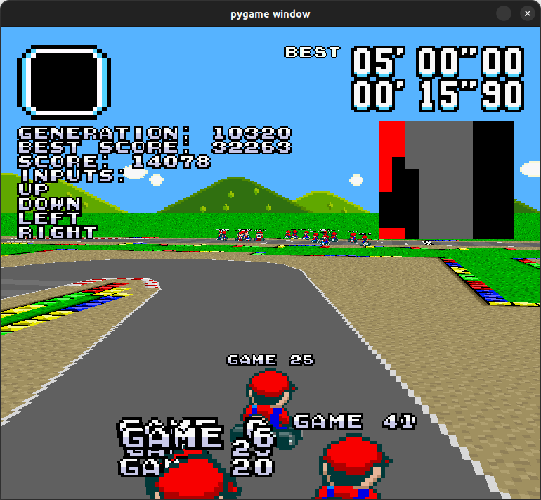

# Super NEAT Kart

## Réalisé par:
  * Hugo D.
  * Efflam O.

## Avertissement
Ce projet a été réalisé dans le cadre d'un projet d'école, il n'est pas destiné à être utilisé en production.
Textures: spriters-resource.com (C) Nintendo, les assets ne sont fournis qu'à des fins d'exemple.

## Description
Ce projet est une application de l'algorithme NEAT (NeuroEvolution of Augmenting Topologies) appliqué à un jeu de course, type Super Mario Kart.
Le but de l'IA est de finir la course en un minimum de temps.

## Pré-requis
Bibliothèques requises: PyOpenGL numpy numba shapely PIL neat pygame graphviz matplotlib
Attention, si vous avez un problème lié à graphviz, il faut rajouter le dossier bin
de cette archive (https://graphviz.gitlab.io/_pages/Download/windows/graphviz-2.38.zip)
dans votre PATH.
Installer les pré-requis avec `pip3 install -r requirements.txt`

## Lancer le jeu
`python3 superneatkart.py`

## Options de lancement:
  * `-h`, `--help` : Affiche de l'aide sur les commandes
  * `-m [X]`, `--map [X]` : Course à charger (Présentes dans "data/maps/")
  * `-t [X]`, `--train [X]` : Entraéner le modèle pour X générations (Si X non spécifié, à l'infini)
  * `-w [X]`, `--watch [X]` : Regarder la génération X jouer (La derniére entrainée si X non spécifié)
  * `-p`, `--play` : Jouer au jeu sans IA

Si vous lancez le jeu sans option, le programme montrera par défaut la dernière
génération entraînée.
Si le nombre de générations entraînées est > 2, alors le programme montrera
des graphiques d'évolution.

## Différentes courses
Bien que différentes courses soient présentes dans les fichiers du jeu, la course "map1"
est recommandée. En effet, l'IA a été entraînée principalement sur cette course.
Cependant, il est tout de même possible de faire tourner l'IA sur ces différentes courses.
Elle ne sera pas capable de finir la plupart sans entraînement (au moins 100 générations).
Nous avons tenté d'entraîner l'IA sur plusieurs courses à la fois, mais les résultats n'étaient
pas concluants. En effet, l'IA semble n'apprendre qu'une seule course, et ne parvient plus à
terminer les courses qu'elle était capable de finir avant. C'est pourquoi nous avons décidé
d'entraîner l'IA sur une seule course, afin qu'elle soit performante au maximum.
